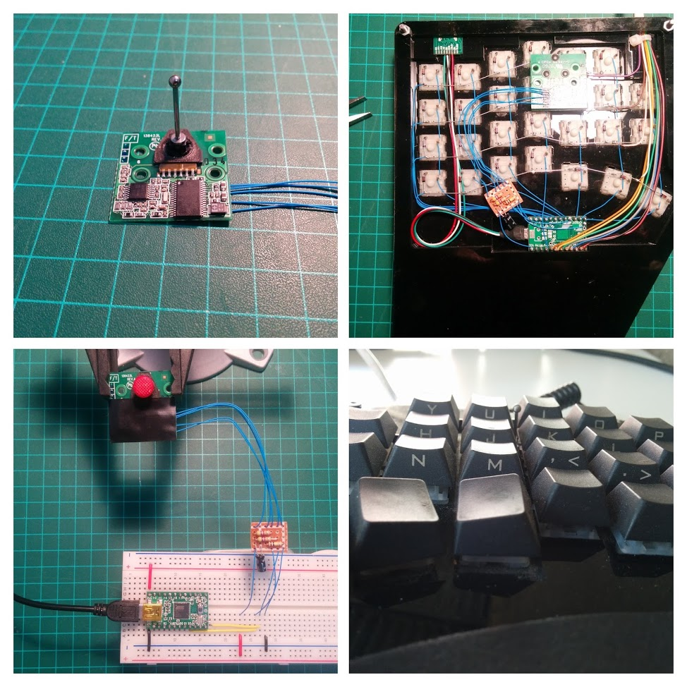
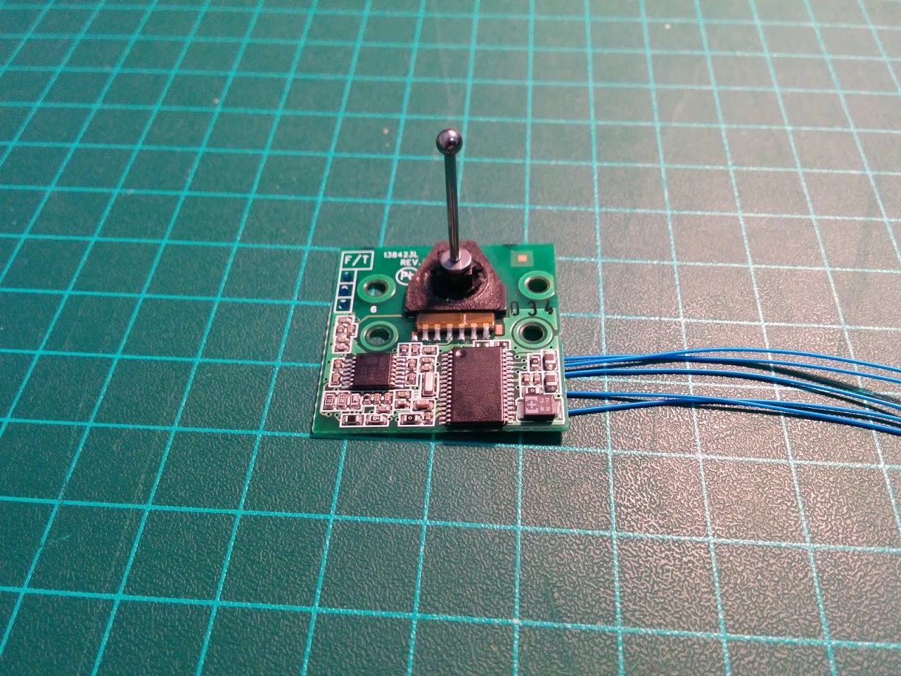
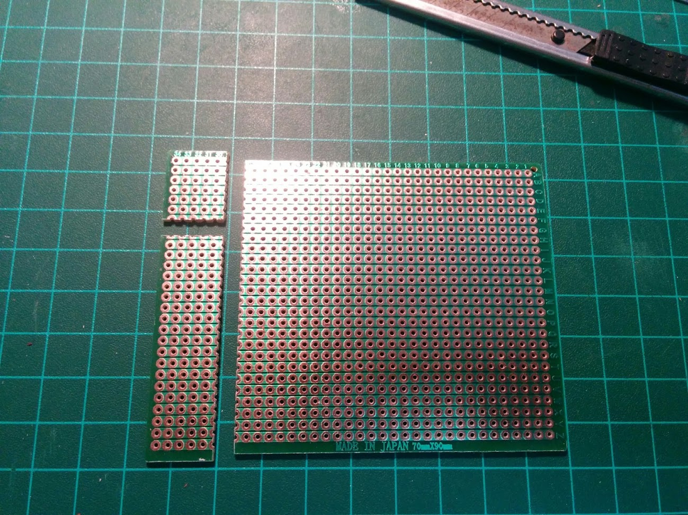
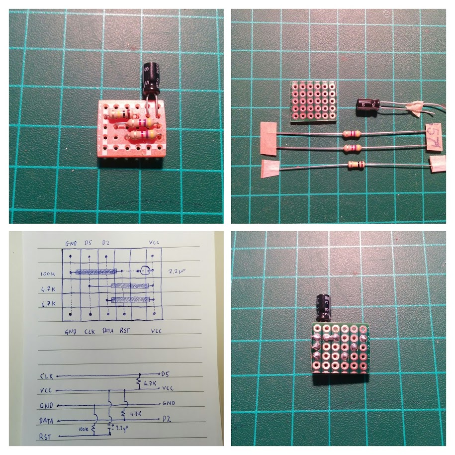
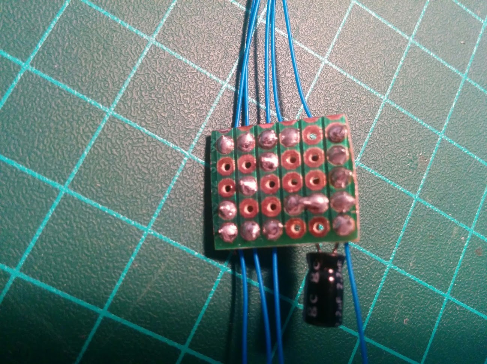
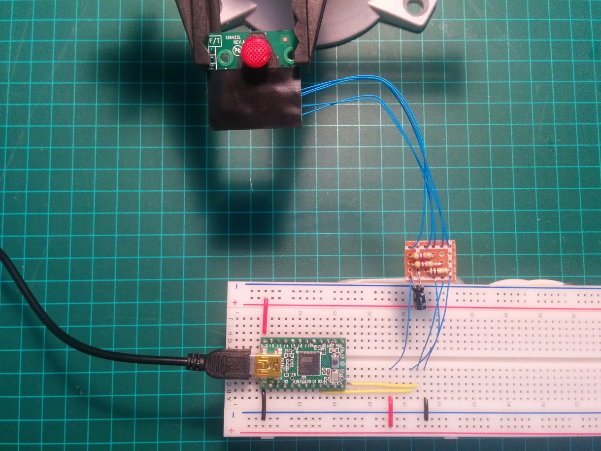
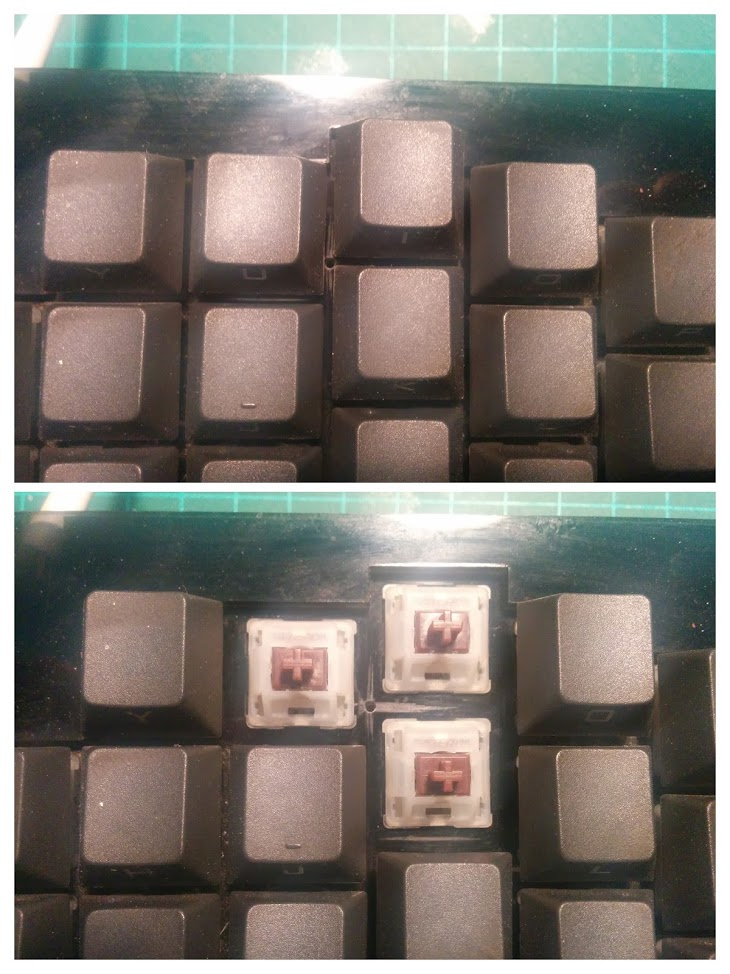
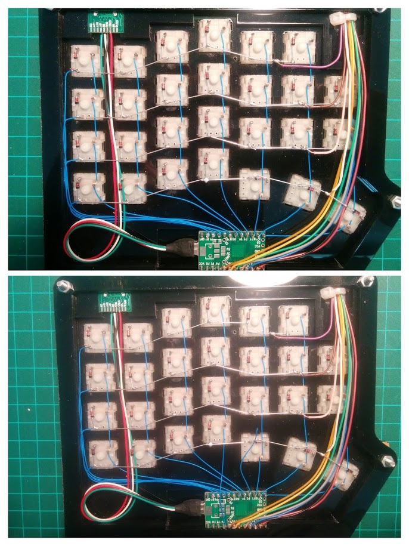
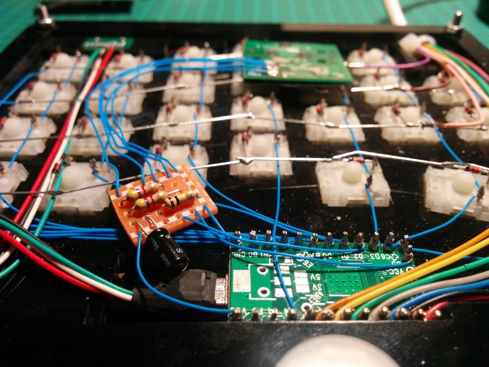
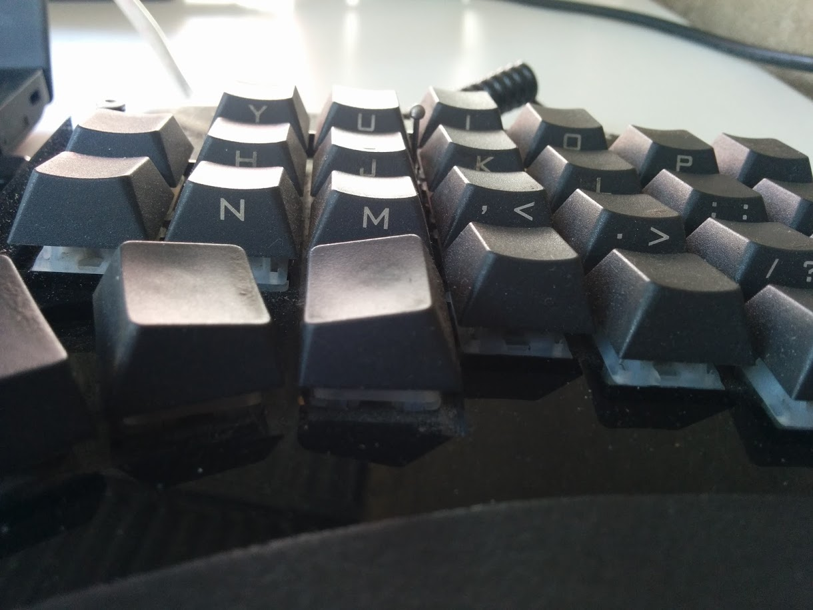

# How to integrate a trackpoint in a mechanical keyboard

This is a summary of what I needed and learned while integrating a
trackpoint into my [custom built hand-wired split mechanical
keyboard][blackhawk]. It took quite a lot of research and planning, so I
thought it would be helpful to others to create this guide.



Before starting this project, the main questions I had were:

- How do I identify the pinout of my trackpoint?
- What should I use for the trackpoint stem?
- Will I need to ruin my keycaps to make space for the stem?
- Can I use the same teensy to power both the keyboard and TP?
- Can I use the TP and keyboard mousekeys concurrently?
- Should I use busywait, interrupt or usart in TMK?
- How do I build the reset circuit?
- Will I have enough clearance inside the case?

There is a lot of useful information scattered around the deskthority
and geekhack forums, and TMK issues, so I'm also including all the
[pinouts][pinouts] I found during my travels, [datasheets][datasheets],
and [TMK keyboard code tweaks](#tmk-firmware-changes-and-tweaks).
(Unfortunately I didn't take note of where I found the above mentioned
resources, so I can't give credit where it is due, for that I apologize.
I'll try retrace my steps, but if you can let me know, I'd be most
welcome).

Thanks to hasu for his awesome TMK firmware, and the deskthority and
geekhack communities - if you have posted something to do with a
trackpoint, I've read it, and it most likely helped :)

Pull requests are welcome, especially new pinouts.

## Table of contents

- [Target audience](#target-audience)
- [FAQ](#faq)
    - [Q: What should I use for the trackpoint stem/stick?](#q-what-should-i-use-for-the-trackpoint-stem/stick)
    - [Q: How do I identify the trackpoint pinout?](#q-how-do-i-identify-the-trackpoint-pinout)
    - [Q: Should I use busywait, interrupt or usart in TMK?](#q-should-i-use-busywait-interrupt-or-usart-in-tmk)
- [What you need](#what-you-need)
- [Steps](#steps)
    - [1. Solder leads to trackpoint](#1-solder-leads-to-trackpoint)
    - [2. Create the reset circuit (RC)](#2-create-the-reset-circuit-rc)
    - [3. Solder leads to reset circuit (RC)](#3-solder-leads-to-reset-circuit-rc)
    - [4. Testing on a breadboard](#4-testing-on-a-breadboard)
    - [5. Make trackpoint stem hole in case](#5-make-trackpoint-stem-hole-in-case)
    - [6. Make space for trackpoint in keyboard](#6-make-space-for-trackpoint-in-keyboard)
    - [7. Test trackpoint clearance and stem length, glue stem](#7-test-trackpoint-clearance-and-stem-length-glue-stem)
    - [8. Solder reset circuit (RC) to teensy](#8-solder-reset-circuit-rc-to-teensy)
    - [9. Finish up](#9-finish-up)
    - [10. Update tmk_keyboard firmware and flash](#10-update-tmk_keyboard-firmware-and-flash)
- [TMK firmware changes and tweaks](#tmk-firmware-changes-and-tweaks)

## Target audience

It's hard to cover every use-case, keyboard and firmware so I'm limiting
this for folks who have a hand-wired mechanical keyboard that uses a
teensy (2.0) with TMK_keyboard firmware, and who want to integrate a
trackpoint for just mouse movement (and take advantage of the keyboard
for mouse keys).

That said, the information here should still be useful for others.

## FAQ

### Q: What should I use for the trackpoint stem/stick?

**A labret cheek piercing! (yes, I know, weird, but it's awesome!)**

- Relatively cheap.
- Super strong (surgical steel, titanium).
- Really thin in diameter (16G is perfect for between keycaps).
- They come in different lengths (8mm to 26mm).
- They have a flat bottom (great for gluing to TP).
- They have a screw on top ball, in different sizes.

I ordered a few sets of different lengths and different diameters (I
wasn't sure if 16G would be strong enough - it is), as well as different
ball sizes from ebay for relatively cheap.

My trackpoint pointer base sits flush under my 3mm switch plate, and
with a cherry MX switch having a height 10.2mm above the switch plate,
and about 1-2mm PBT cherry keycap on top, the 14mm stem with 3mm ball is
kind of perfect.

For extra friction on the ball, I used some sandpaper.



### Q: How do I identify the trackpoint pinout?

**With some luck, or a multimeter and a steady hand.**
(A scope would be better, but unfortunately I don't have one).

If you're lucky, someone has already identified the pinout of the
trackpoint you have (see [pinouts][pinouts]), or at least a similar one.

If not, you'll need to identify the pinout yourself, here are some tips:

- The largest tracer is most likely GND.
- The second largest tracer is most likely VCC.
- Using a multimeter and the PTPM754 [datasheet][datasheets], test for
  connectivity:

```
CLK (INT0)    - PTPM754 pin 24
DATA (TXD/1)  - PTPM754 pin 2
RST           - PTPM754 pin 5
GND           - PTPM754 pin 8
VCC           - PTPM754 pin 22
```

- Alternatively, if you have a scope and know what you're doing:

```
CLK  - should have a frequency reading
DATA - should have a 5V reading
RST  - should have a 0V reading
```

### Q: Should I use busywait, interrupt or usart in TMK?

As far as I know, USART is the recommended implementation, as it uses
hardware for PS/2 signal receive.

You will need to use D2 (data) and D5 (clock) on the teensy though.

## What you need

- Keyboard with at least 6mm clearance between switch and base plates,
  depending on the trackpoint module height.
- TMK_keyboard firmware source code and development environment.
- Teensy 2.0 (pins D2 and D5 available for USART).
- Trackpoint module (salvaged from old thinkpad or new tp keyboard).
- Veroboard (for reset circuit).
- Reset circuit components (4.7k resistors x2, 100k resistor, 2.2uF capacitor).
- Stem for trackpoint (labret cheek piercing 16G).
- Double sided tape (for testing stem lengths before gluing).
- Glue (stem to trackpoint, I used Loctite super glue-3)
- Cutting knife (x-acto, nt-cutter, japanese knife, etc.).
- Sandpaper (extra friction to stem ball, smooth veroboard cuts).
- Thin wire (I used wire wrap 30 gauge).
- Wire cutter and stripper.
- PCB drill / thin rounded file (to make a 1.2mm hole).
- Insulation tape (prevent shorts, protect trackpoint circuitry).
- Soldering equipment.
- Multi-meter.
- Patience.

- Bonus: extra teensy and breadboard for testing.

## Steps

### 1. Solder leads to trackpoint

- What you need:

    - Thin wire (I used wire wrap 30 guage wire)
    - Wire cutter and stripper
    - Soldering equipment
    - Bonus: helping hand

- Cut and strip 5 leads.
- Clean and tin the trackpoint pads to be soldered.
- Use a helping hand to hold the leads on the tinned pads, and heat the
  stripped leads so they solder to the pad.

### 2. Create the reset circuit (RC)

- What you need:

    - 4.7k resistors x2
    - 100k resistor
    - 2.2uF capacitor
    - Veroboard
    - Cutting knife (x-acto, nt-cutter, japanese knife, etc.)
    - Sandpaper
    - Soldering equipment
    - Insulation tape

- Cut a piece of veroboard (6x5 - the 5 is for rails)

    - Using the cutting knife, perform 5-10 cuts on both sides.
    - Using a little pressure, snap the board on the cut.
    - Use sandpaper to smooth out the cut edges.



- Place the components on the veroboard, and solder

    - Resistors

        - Resistors don't have polarity, no need to worry.
        - Bend component legs, insert into veroboard.
        - On the back-side, slightly bend legs so components stay in position.
        - Use insulation tape to hold resistors in position if needed.
        - Snip legs (leaving about 3-5mm) and solder.
        - Snip the protruding legs for extra clearance.

    - Capacitor

        - Capacitors have polarity, usually marked with a minus (negative).
        - Positive leg must go in the VCC rail.
        - Insert capacitor legs partially, so it can be bent off the
          veroboard for clearance inside the keyboard case.
        - On the back-side, bend legs slightly so it stays in position.
        - Use insulation tape to hold capacitor in position.
        - Snip legs and bend negative over to 100k resistor pad, and solder.
        - Snip the protruding leg for extra clearance.



### 3. Solder leads to reset circuit (RC)

- What you need:

    - Thin wire (I used wire wrap 30 guage wire).
    - Wire cutter and stripper.
    - Soldering equipment.
    - Bonus: helping hand.

- Solder trackpoint leads to reset circuit.
- Cut, strip and solder leads to reset circuit that will go to the teensy.



### 4. Testing on a breadboard

- Insert teensy in breadboard.
- Insert leads from RC into breadboard connected to teensy pins.
- Update firmware to enable PS2 mouse and USART (see below).
- Flash firmware to teensy, and test.



### 5. Make trackpoint stem hole in case

- What you need:

    - PCB drill / thin rounded file (to make a 1.2mm hole).

- Decide where you want the trackpoint stem - I prefer using my middle
  finger and have a row staggered keyboard, so I positioned it on the
  cross section between U/I/K (QWERTY layout).

- Locate position for trackpoint stem, and scratch or mark the space
  available.

- Remove the keycaps, make the hole (slowly and carefully), replace
  keycaps.

- Test stem diameter in hole. Should be rigid with a slight amount of
  slack.



### 6. Make space for trackpoint in keyboard

- What you need:

    - Insulation tape.
    - Wire cutter.

- Add insulation tape to trackpoint to prevent shorts.
- Rewire diodes / column wires if needed for trackpoint clearance.
- Trim switch legs if needed for trackpoint clearance.
- Relocate D2 and D5 pins if they are already being used.



### 7. Test trackpoint clearance and stem length, glue stem

- What you need:

    - Stem for trackpoint (labret cheek piercing 16G, different lengths).
    - Double sided tape.
    - Glue (loctite super glue-3).
    - Sandpaper.

- Remove red cap.
- Stick a stem to trackpoint pointer base with double side tape.
- Insert trackpoint with stem into hole.
- Close case, flip keyboard, screw on stem ball, test.
- Rinse and repeat for other stems until satisfied with length.

- Remove double sided tape, glue stem.
- Use sandpaper to roughen up the stem ball for added friction.

### 8. Solder reset circuit (RC) to teensy

- Solder leads to teensy:

```
VCC  -> teensy VCC
GND  -> teensy GND
CLK  -> teensy D5
DATA -> teensy D2
```



### 9. Finish up

- Verify trackpoint is positioned squarely, and close case.
- Screw on stem ball.



### 10. Update tmk_keyboard firmware and flash

- What you need:

    - TMK keyboard firmware and development environment.

- Update firmware with PS2 mouse and USART support (see below).
- Plug in keyboard, flash and test.

## TMK firmware changes and tweaks

- Configure PS2 mouse and USART support: [diff][tmk_usart]
- Configure mousekeys: [keycodes][tmk_keycodes], [keymap][tmk_keymap]
- Enable concurrent trackpoint movement and mousekeys: [diff][tmk_concurrent]
- Trackpoint polling interval delay for dropped key strokes: [diff1][tmk_poll1], [diff2][tmk_poll2]
- Todo: auto-enable mouse-layer on tp movement.


[blackhawk]: http://www.alonswartz.org/keyboards/blackhawk/
[pinouts]: ./pinouts/
[datasheets]: ./datasheets/

[tmk_usart]: https://github.com/alonswartz/tmk_keyboard/commit/f20a6f8fed823e5406f783b51db96c07ee14f079
[tmk_keycodes]: https://github.com/alonswartz/tmk_keyboard/blob/blackhawk/tmk_core/doc/keycode.txt#L212
[tmk_keymap]: https://github.com/alonswartz/tmk_keyboard/blob/1de1336fe06905893340df78ce43e9cafdbf32c9/keyboard/blackhawk/keymap_default.c#L23
[tmk_concurrent]: https://github.com/alonswartz/tmk_keyboard/commit/e71670a120b0b0f746b13f593df0c988f03d277c
[tmk_poll1]: https://github.com/alonswartz/tmk_keyboard/commit/a5c7dc87bb9f2872483f40482060a645e00e7557
[tmk_poll2]: https://github.com/alonswartz/tmk_keyboard/commit/1de1336fe06905893340df78ce43e9cafdbf32c9

